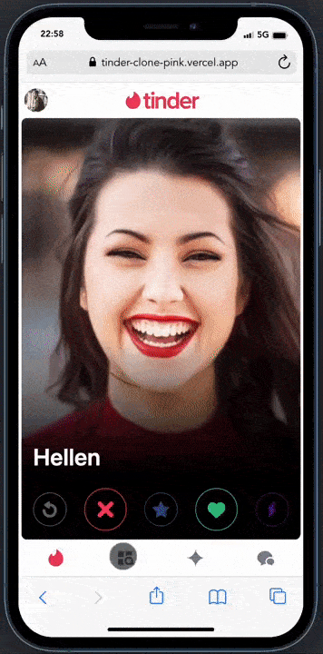
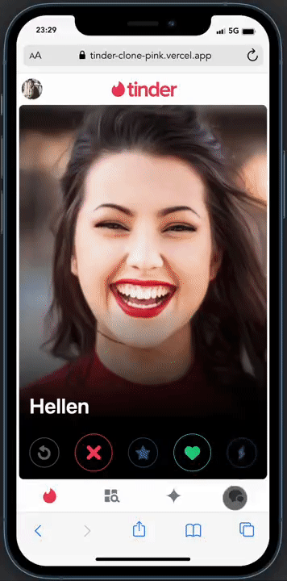

# Tinder clone DEMO with Next.js

This example shows a practical demo of Tinder web based on mobile only to swipe cards and match with someone. Also there's a chat with any match in realtime.

## Preview

You can view the example deployed on Vercel:

[Visit project](https://tinder-clone-pink.vercel.app/)

## Screens




## Technology stack:

- [Firebase v9](https://firebase.google.com/docs/web/modular-upgrade#update_imports_to_v9_compat)
- [Next.js](https://nextjs.org/)
- [React Tinder Card](https://www.npmjs.com/package/react-tinder-card)
- [Styled components with Emotion](https://emotion.sh/docs/styled)
- [Vercel](https://vercel.com/)

## How to use

To run the project execute the command:

```bash
npm run dev
```
